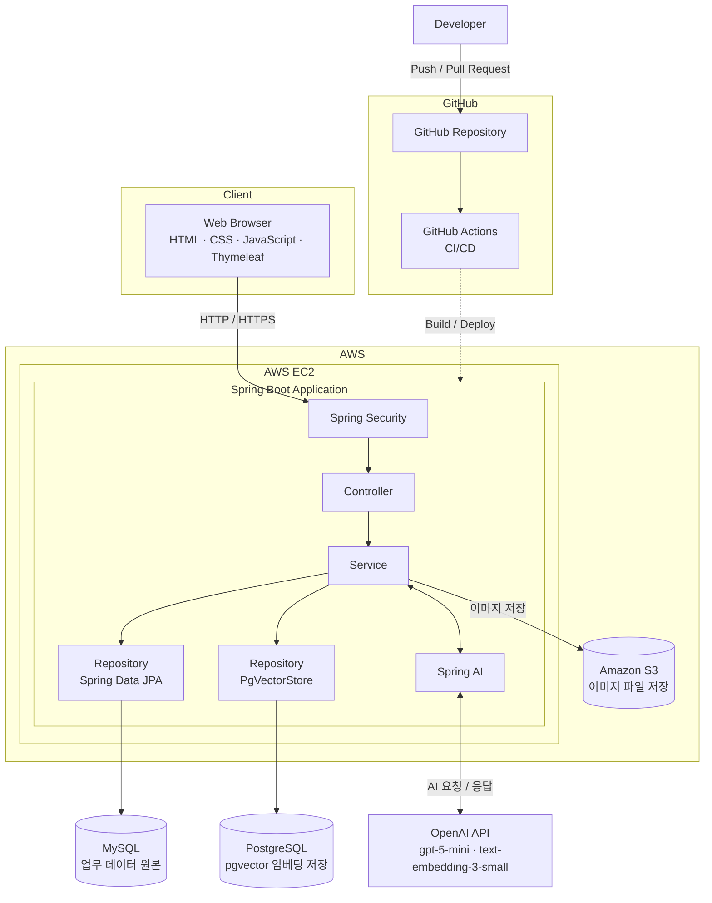

<p align="center">
  
</p>

<div align="center">

> **구직자와 기업을 연결하는 AI 기반 채용 플랫폼**

개인회원, 기업회원, 관리자 서비스를 분리하고  
Spring AI와 OpenAI를 활용한 채용 지원 기능을 제공합니다.

</div>

---

## 🖥 서비스 미리보기


https://github.com/user-attachments/assets/a5f261b9-52eb-4a46-8058-9b3d4efd002f


---

## 📖 프로젝트 소개

- 구직자와 기업을 연결하는 AI 기반 채용 플랫폼
- 개인회원, 기업회원, 관리자 서비스를 분리한 채용 서비스
- 실제 채용 프로세스를 반영한 입사지원 및 채용 관리 기능 구현
- Spring AI 기반 자기소개서 첨삭 및 채용공고 문장 다듬기 기능 구현
- 희망 직무를 기반으로 한 맞춤 채용공고 추천 기능 제공

---

## 📅 개발 기간

- **2026.07.20 ~ 2026.09.03**

---

<details>
<summary><strong>🛠 Tech Stack</strong></summary>

### 🎨 Frontend

<p>
  
</p>

- HTML5
- CSS3
- JavaScript
- Thymeleaf

### ⚙️ Backend

<p>
  
</p>

- Java 21
- Spring Boot
- Spring Security
- Spring Data JPA
- Spring AI
- Gradle

### 🗄️ Database

<p>
  
</p>

- MySQL (회원·기업·공고·지원 등 업무 데이터 원본)
- PostgreSQL + pgvector (AI 임베딩 검색 전용 파생 데이터)

### 🤖 AI

<p>
  
</p>

- Spring AI (OpenAI 연동)
- Chat: `gpt-5-mini`
- Embedding: `text-embedding-3-small` (dimension 1024)

### ☁️ Infrastructure

<p>
  
</p>

- AWS EC2
- Amazon S3
- GitHub Actions 적용 예정

### 🛠️ Tools & Collaboration

<p>
  
</p>

- Git
- GitHub
- Figma
- IntelliJ IDEA
- Visual Studio Code
- Notion

</details>

---

<details>
<summary><strong>🏗 프로젝트 아키텍처</strong></summary>



</details>

---

<details>
<summary><strong>🔐 사용자 권한</strong></summary>

| 권한     | 주요 접근 영역                                      |
| -------- | --------------------------------------------------- |
| 비회원   | 채용공고, 기업정보, 기업 후기 일부, 고객센터 조회   |
| 개인회원 | 이력서, 자기소개서, 입사지원, 관심 정보, 후기 작성  |
| 기업회원 | 기업정보, 채용공고, 지원자 및 채용 단계 관리        |
| 관리자   | 회원, 공고, 후기, 신고, 배너, 정책 및 고객센터 관리 |

</details>

---

<details>
<summary><strong>✨ 주요 기능</strong></summary>

### 👤 개인회원

<details>
<summary><strong>👤 개인회원 기능 펼치기</strong></summary>

#### 📊 대시보드

- 최근 수정한 이력서 조회
- 최근 지원 현황 조회
- 관심 채용공고 및 관심 기업 확인
- 희망 직무 기반 맞춤 채용공고 추천

#### 🙍 개인정보 및 경력 관리

- 개인정보 조회 및 수정
- 희망 직무 최대 3개 설정
- 근무 이력 관리
- 기술스택 선택
- 비밀번호 변경
- 회원 탈퇴

#### 📄 이력서

- 이력서 다중 등록
- 이력서 조회 / 수정 / 삭제
- 학력, 경력, 기술스택 관리
- 입사지원 시 제출 이력서 선택

#### ✍ 자기소개서

- 자기소개서 등록 / 수정 / 삭제
- Spring AI 기반 자기소개서 첨삭
- 원문 및 AI 첨삭 결과 확인

#### 📨 입사지원

- 제출 이력서 선택
- 제출 자기소개서 선택
- 지원 상세 내역 조회
- 단계별 지원 현황 조회
- 지원완료 상태에서 지원 취소
- 제출한 이력서 및 자기소개서 확인

#### ⭐ 관심 기능

- 관심 채용공고 등록 / 해제
- 관심 기업 등록 / 해제
- 관심 기업의 채용공고 확인

#### 🏢 기업 정보

- 기업 목록 및 상세 조회
- 기업별 채용공고 조회
- 기업 리뷰 및 면접 후기 조회
- 기업 연봉 정보 조회

#### 📝 후기 및 연봉 정보

- 근무 이력을 기반으로 기업 리뷰 작성
- 지원 이력을 기반으로 면접 후기 작성
- 근무 이력을 기반으로 연봉 정보 등록
- 후기 추천 및 신고

#### 🛟 고객센터

- 공지사항 조회
- FAQ 조회
- 1:1 문의 등록 및 조회
- 첨부파일 다운로드

</details>

---

### 🏢 기업회원

<details>
<summary><strong>🏢 기업회원 기능 펼치기</strong></summary>

#### 📊 대시보드

- 등록한 채용공고 수
- 진행 중인 채용공고 수
- 신규 지원자 수
- 면접 대상자 수
- 채용 완료 인원 확인

#### 🏢 기업 정보

- 기업 기본정보 조회 및 수정
- 기업 소개 및 로고 관리
- 복지 및 근무환경 관리

#### 📢 채용공고

- 채용공고 등록 / 조회 / 수정 / 삭제
- 채용공고 임시저장
- 채용공고 미리보기
- 채용공고 마감 처리
- 마감된 공고 수정 제한

#### 🤖 AI 채용공고 문장 다듬기

- 입력한 채용공고 문장 교정
- 주요 업무 표현 개선
- 자격요건 및 우대사항 문장 정리
- 원문과 AI 수정 결과 비교

#### 👥 지원자 관리

- 채용공고별 지원자 조회
- 지원자 상세정보 조회
- 제출 이력서 및 자기소개서 조회
- 지원자의 채용 단계 변경
- 면접 예정 및 최종 합격 처리
- 입사 완료 처리

#### ⚙ 계정 관리

- 담당자 정보 수정
- 비밀번호 변경
- 연락처 변경
- 회원 탈퇴

</details>

---

### 🛠 관리자

<details>
<summary><strong>🛠 관리자 기능 펼치기</strong></summary>

#### 📊 대시보드

- 회원 현황
- 기업회원 현황
- 채용공고 현황
- 신고 현황
- 방문자 통계

#### 👤 회원 관리

- 개인회원 목록 및 상세 조회
- 기업회원 목록 및 상세 조회
- 회원 상태 관리

#### 📢 채용공고 관리

- 채용공고 목록 조회
- 채용공고 상세 조회
- 채용공고 상태 확인
- 부적절한 채용공고 관리

#### 🗂 직무 카테고리 관리

- 1차 직무 카테고리 관리
- 2차 직무 카테고리 관리
- 카테고리 사용 건수 확인
- 드래그 앤 드롭 노출 순서 변경

#### 📝 후기 관리

- 기업 리뷰 목록 및 상세 조회
- 면접 후기 목록 및 상세 조회
- 후기 공개 및 숨김 상태 관리

#### 🚨 신고 관리

- 기업 리뷰 신고 조회
- 면접 후기 신고 조회
- 콘텐츠별 신고 건수 확인
- 신고 승인 및 콘텐츠 숨김 처리

#### 📚 고객센터 관리

- 공지사항 등록 / 수정 / 삭제
- FAQ 등록 / 수정 / 삭제
- 1:1 문의 조회 및 답변

#### 🎨 배너 관리

- 메인 배너 관리
- 채용 페이지 배너 관리
- 기업정보 페이지 배너 관리
- 배너 이미지 및 링크 설정
- 배너 노출 기간 관리
- 배너 노출 순서 관리
- 배너 공개 상태 관리

#### 📜 정책 및 약관 관리

- 이용약관 관리
- 개인정보 처리방침 관리
- 개인회원 가입 약관 관리
- 기업회원 가입 약관 관리
- 마케팅 및 채용정보 수신 약관 관리

#### 🏷 사이트 버전 관리

- 사이트 버전 등록
- 버전별 변경 이력 조회
- 활성 버전 관리

</details>

</details>

---

<details>
<summary><strong>🔄 주요 서비스 흐름</strong></summary>

### 👤 개인회원

```text
회원가입
→ 희망 직무 설정
→ 이력서 및 자기소개서 작성
→ 채용공고 탐색
→ 입사지원
→ 지원 현황 확인
```

### 🏢 기업회원

```text
기업회원 가입
→ 기업정보 등록
→ 채용공고 작성
→ 지원자 확인
→ 채용 단계 변경
→ 최종 합격 및 입사 완료 처리
```

### 🛠 관리자

```text
회원 및 채용공고 조회
→ 후기 및 신고 관리
→ 고객센터 관리
→ 배너 및 정책 관리
```

</details>

---

<details>
<summary><strong>📨 입사지원 프로세스</strong></summary>

```text
지원완료
→ 서류검토중
→ 서류합격
→ 면접예정
→ 면접완료
→ 최종합격
→ 입사완료
```

> 지원 취소는 `지원완료` 단계에서만 가능합니다.

</details>

---

<details>
<summary><strong>🤖 Spring AI</strong></summary>

> AI는 사용자의 판단을 대신하지 않고, 구직자와 기업회원의 작성을 보조하는 용도로 활용했습니다.

### ✍ 자기소개서 AI 첨삭

- 자기소개서 문장 분석
- 어색한 문장 및 표현 교정
- 내용 전달력 개선
- 원문과 첨삭 결과 비교

### 📢 채용공고 문장 다듬기

- 기업회원이 작성한 채용공고 문장 교정
- 주요 업무와 자격요건 표현 개선
- 우대사항 및 포지션 소개 문장 정리

### 🎯 맞춤 채용공고 추천

- 개인회원이 설정한 희망 직무 활용
- 희망 직무와 연관된 채용공고 제공

</details>

---

<details>
<summary><strong>🗄 MySQL 전체 ERD 펼쳐보기</strong></summary>

<br>

<a href="./database/docs/erd/firstday-mysql-erd.svg?raw=1">
  
</a>

<p align="center">
  이미지를 클릭하면 원본 SVG를 확대해 확인할 수 있습니다.<br>
  MySQL 8.0 기준 37개 테이블의 PK·FK 및 전체 컬럼을 기능 영역별로 구분했습니다.
</p>

</details>

<details>
<summary><strong>🧠 PostgreSQL AI 스키마 펼쳐보기</strong></summary>

<br>

<a href="./database/docs/erd/firstday-postgresql-erd.svg?raw=1">
  
</a>

<p align="center">
  이미지를 클릭하면 원본 SVG를 확대해 확인할 수 있습니다.<br>
  PostgreSQL의 <code>ai.vector_store</code>, pgvector 타입과 HNSW·GIN 인덱스 구성을 표시했습니다.
</p>

</details>

---

<details>
<summary><strong>📂 프로젝트 구조</strong></summary>

> 🚧 실제 패키지 구조 확정 후 작성 예정

```text
src/main/java/com/firstjob
├── config
├── controller
├── service
├── repository
├── entity
├── dto
└── domain
    ├── member
    ├── company
    ├── recruitment
    ├── application
    ├── resume
    ├── review
    ├── support
    └── admin
```

</details>

---

<details>
<summary><strong>🤝 협업 방식</strong></summary>

- 기능 단위 브랜치 생성 후 Pull Request 진행
- `main` 브랜치 직접 Push 제한
- Pull Request 승인 후 병합
- 공통 UI와 개발 규칙은 Notion 문서로 관리
- Figma 화면 설계를 기준으로 UI 구현
- GitHub를 활용한 소스코드 및 버전 관리

</details>

---

<details>
<summary><strong>👨‍💻 담당 역할</strong></summary>

| 이름       | 담당 역할                                           |
| ---------- | --------------------------------------------------- |
| **양지웅** | 회원 · 인증 · 권한 · 이력서 · 기업정보 · 기업 승인  |
| **오수현** | 채용공고 · 입사지원 · 지원자 관리                   |
| **최수빈** | 메인 · 기업 조회 · 후기 · 연봉 · 관심 · 신고 · 배너 |
| **강현주** | 자기소개서 · 고객센터 · 사이트 운영 설정            |

</details>

---

<details>
<summary><strong>🔥 트러블슈팅</strong></summary>

> 🚧 작성 예정

</details>

---

<details>
<summary><strong>🔗 프로젝트 링크</strong></summary>

| 구분       | 링크                                                                                                                                                                                                                                              |
| ---------- | ------------------------------------------------------------------------------------------------------------------------------------------------------------------------------------------------------------------------------------------------- |
| **Figma**  | [첫출근 Figma 화면 설계](https://www.figma.com/design/yfEUfs6dqpNpTQOX1sdYrt/3%EC%B0%A8-%ED%94%84%EB%A1%9C%EC%A0%9D%ED%8A%B8---%EC%B1%84%EC%9A%A9%EC%82%AC%EC%9D%B4%ED%8A%B8--%EC%B2%AB%EC%B6%9C%EA%B7%BC-?node-id=44-2&p=f&t=BK3PM2eLkhEFxHFT-0) |
| **Notion** | 🚧 추가 예정                                                                                                                                                                                                                                      |
| **Video**  | 🚧 추가 예정                                                                                                                                                                                                                                      |

</details>

---

<p align="center">
  
</p>
