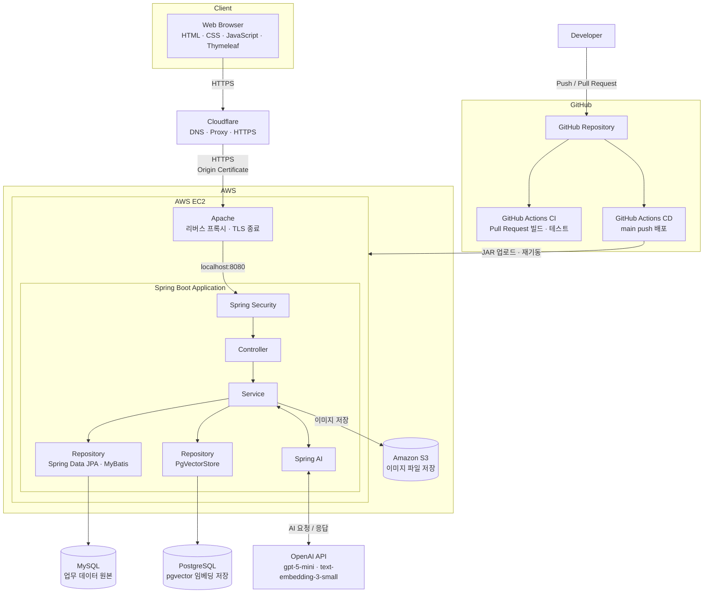
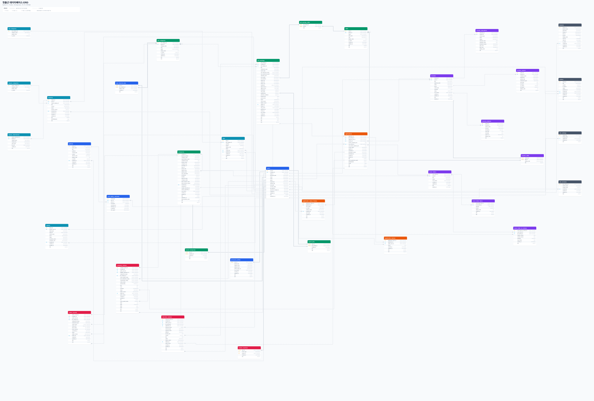
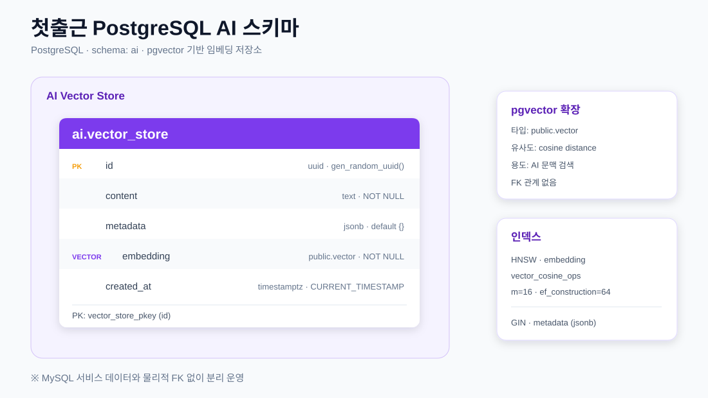

<p align="center">
  
</p>

<div align="center">

> **구직자와 기업을 연결하는 AI 기반 채용 플랫폼**

개인회원, 기업회원, 관리자 서비스를 분리하고  
Spring AI와 OpenAI를 활용한 채용 지원 기능을 제공합니다.

</div>

---

## 🖥 서비스 미리보기


https://github.com/user-attachments/assets/a5f261b9-52eb-4a46-8058-9b3d4efd002f


---

## 📖 프로젝트 소개

- 구직자와 기업을 연결하는 AI 기반 채용 플랫폼
- 개인회원, 기업회원, 관리자 서비스를 분리한 채용 서비스
- 실제 채용 프로세스를 반영한 입사지원 및 채용 관리 기능 구현
- Spring AI 기반 자기소개서 첨삭 및 채용공고 문장 다듬기 기능 구현
- 이력서와 희망 직무를 반영한 맞춤 채용공고 추천 기능 제공

---

## 📅 개발 기간

- **2026.07.20 ~ 2026.09.03**

---

<details>
<summary><strong>🛠 Tech Stack</strong></summary>

### 🎨 Frontend

<p>
  
</p>

- HTML5
- CSS3
- JavaScript
- Thymeleaf

### ⚙️ Backend

<p>
  
</p>

- Java 21
- Spring Boot 4.0
- Spring Security
- Spring Data JPA
- MyBatis (목록 조회·통계 등 동적 쿼리)
- Spring Validation
- Spring Mail (이메일 인증코드 발송)
- Spring Boot Actuator
- Spring AI
- Gradle

### 🗄️ Database

<p>
  
</p>

- MySQL (회원·기업·공고·지원 등 업무 데이터 원본)
- PostgreSQL + pgvector (AI 임베딩 검색 전용 파생 데이터)

### 🤖 AI

<p>
  
</p>

- Spring AI (OpenAI 연동)
- Chat: `gpt-5-mini`
- Embedding: `text-embedding-3-small` (dimension 1024)
- Vector Store: PgVectorStore (HNSW · cosine)

### ☁️ Infrastructure

<p>
  
</p>

- AWS EC2 (Apache 리버스 프록시 + Spring Boot 애플리케이션)
- Amazon S3 (이미지 파일 저장)
- Cloudflare (DNS · 프록시 · HTTPS)
- GitHub Actions
  - CI: Pull Request 시 빌드 및 테스트 검증
  - CD: `main` 브랜치 push 시 EC2 자동 배포

### 🛠️ Tools & Collaboration

<p>
  
</p>

- Git
- GitHub
- Figma
- IntelliJ IDEA
- Visual Studio Code
- Notion

</details>

---

<details>
<summary><strong>🏗 프로젝트 아키텍처</strong></summary>



> 외부에서 EC2의 `8080` 포트로 직접 접근할 수 없으며, `80` · `443`은 Cloudflare 대역만 허용합니다.

</details>

---

<details>
<summary><strong>🔐 사용자 권한</strong></summary>

| 권한     | 주요 접근 영역                                      |
| -------- | --------------------------------------------------- |
| 비회원   | 채용공고, 기업정보, 기업 후기 일부, 고객센터 조회   |
| 개인회원 | 이력서, 자기소개서, 입사지원, 관심 정보, 후기 작성  |
| 기업회원 | 기업정보, 채용공고, 지원자 및 채용 단계 관리        |
| 관리자   | 회원, 공고, 후기, 신고, 배너, 정책 및 고객센터 관리 |

</details>

---

<details>
<summary><strong>✨ 주요 기능</strong></summary>

### 👤 개인회원

<details>
<summary><strong>👤 개인회원 기능 펼치기</strong></summary>

#### 🔑 회원가입 및 계정

- 개인 / 기업 회원 유형 선택 후 가입
- 약관 동의 및 필수 약관 검증
- 아이디 중복 확인
- 이메일 인증코드 발송 및 검증
- 아이디 찾기
- 이메일 인증코드 기반 비밀번호 재설정

#### 📊 대시보드

- 최근 수정한 이력서 및 자기소개서 조회
- 최근 지원 현황 조회
- 이력서 및 자기소개서 보유 수 확인
- 관심 채용공고 수와 마감 임박 건수 확인
- 관심 기업 수와 신규 등록 공고 수 확인

#### 🙍 개인정보 및 경력 관리

- 개인정보 조회 및 수정
- 희망 직무 최대 3개 설정
- 근무 이력 관리
- 기술스택 선택
- 비밀번호 변경
- 회원 탈퇴

#### 📄 이력서

- 이력서 다중 등록
- 이력서 조회 / 수정 / 삭제
- 학력, 경력, 프로젝트, 기술스택 관리
- 입사지원 시 제출 이력서 선택

#### ✍ 자기소개서

- 문항 단위 자기소개서 등록 / 수정 / 삭제
- 대상 채용공고를 선택한 AI 첨삭 요청
- 원문과 AI 첨삭 결과 및 피드백 확인

#### 🔍 채용공고 탐색

- 키워드 검색
- 1차 · 2차 직무 카테고리 필터
- 지역, 경력, 학력, 기술스택 필터
- 정렬 및 페이지 이동
- 채용공고 상세 조회
- AI 맞춤 채용공고 추천과 매칭 점수 확인

#### 📨 입사지원

- 제출 이력서 선택
- 제출 자기소개서 선택
- 지원 상세 내역 조회
- 단계별 지원 현황 조회
- 지원완료 상태에서 지원 취소
- 제출한 이력서 및 자기소개서 확인

#### ⭐ 관심 기능

- 관심 채용공고 등록 / 해제
- 관심 기업 등록 / 해제
- 관심 기업의 채용공고 확인

#### 🏢 기업 정보

- 기업 목록 및 상세 조회
- 기업별 채용공고 조회
- 기업 리뷰 및 면접 후기 조회
- 기업 연봉 정보 조회

#### 📝 후기 및 연봉 정보

- 근무 이력을 기반으로 기업 리뷰 작성
- 지원 이력을 기반으로 면접 후기 작성
- 근무 이력을 기반으로 연봉 정보 등록
- 작성한 후기 조회 / 수정 / 삭제
- 후기 도움돼요 및 신고

#### 🛟 고객센터

- 공지사항 조회
- FAQ 조회
- 1:1 문의 등록 및 조회
- 첨부파일 다운로드

</details>

---

### 🏢 기업회원

<details>
<summary><strong>🏢 기업회원 기능 펼치기</strong></summary>

#### 🔑 가입 및 기업정보 심사

- 사업자등록번호 중복 확인 후 기업회원 가입
- 기업정보 작성 후 관리자 심사 요청
- 반려 사유 확인 및 기업정보 재제출
- 승인 완료 후 채용공고 등록 기능 활성화

#### 📊 대시보드

- 모집중 채용공고 수
- 마감 임박 채용공고 수
- 최근 7일 및 오늘 지원자 수
- 검토 대기 지원자 수
- 채용공고 총 조회수
- 최근 지원자 및 최근 채용공고 목록

#### 🏢 기업 정보

- 기업 기본정보 조회 및 수정
- 기업 소개 및 로고 관리
- 복지 및 근무환경 관리

#### 📢 채용공고

- 채용공고 등록 / 조회 / 수정 / 삭제
- 채용공고 임시저장
- 모집 시작일 예약 등록으로 모집예정 처리
- 시작일 도래 시 모집중 자동 전환, 마감일 도래 시 마감 자동 전환
- 상태별 채용공고 목록 조회
- 채용공고 마감 처리
- 마감된 공고 수정 제한
- 관리자가 숨김 처리한 공고 수정

#### 🤖 AI 채용공고 문장 다듬기

- 입력한 채용공고 문장 교정
- 주요 업무 표현 개선
- 자격요건 및 우대사항 문장 정리
- 원문과 AI 수정 결과 비교

#### 👥 지원자 관리

- 채용공고별 지원자 조회
- 지원자 상세정보 조회
- 제출 이력서 및 자기소개서 조회
- 지원자의 채용 단계 변경
- 면접 예정 및 최종 합격 처리
- 입사 완료 처리
- 지원자별 메모 작성

#### ⚙ 계정 관리

- 담당자 정보 수정
- 비밀번호 변경
- 연락처 변경
- 회원 탈퇴

</details>

---

### 🛠 관리자

<details>
<summary><strong>🛠 관리자 기능 펼치기</strong></summary>

#### 📊 대시보드

- 기업 승인 대기 건수
- 당일 등록 채용공고 수
- 미처리 신고 건수
- 미답변 1:1 문의 건수
- 장기 미처리 건 확인
- 당일 신규 회원, 지원, 후기, 신고, 답변 현황

#### 👤 개인회원 관리

- 개인회원 목록 및 상세 조회
- 최근 로그인 이력 확인
- 이용정지 및 정지 해제
- 정지 시 활성 세션 만료 처리

#### 🏢 기업회원 관리

- 기업회원 목록 및 상세 조회
- 기업정보 심사 및 승인 / 반려
- 이용정지 및 정지 해제
- 정지 시 활성 세션 만료 처리

#### 📢 채용공고 관리

- 채용공고 목록 조회
- 채용공고 상세 조회
- 채용공고 상태 확인
- 부적절한 채용공고 숨김 처리
- 숨김 유지 및 숨김 해제

#### 🗂 직무 카테고리 및 기술스택 관리

- 1차 직무 카테고리 관리
- 2차 직무 카테고리 관리
- 기술스택 등록 / 수정 / 삭제 / 복구
- 카테고리 사용 건수 확인
- 드래그 앤 드롭 노출 순서 변경

#### 📝 후기 및 연봉 관리

- 기업 리뷰 목록 및 상세 조회
- 면접 후기 목록 및 상세 조회
- 후기 공개 및 숨김 상태 관리
- 등록된 연봉 정보 검수

#### 🚨 신고 관리

- 기업 리뷰 신고 조회
- 면접 후기 신고 조회
- 콘텐츠별 신고 건수 확인
- 신고 승인 및 콘텐츠 숨김 처리

#### 📚 고객센터 관리

- 공지사항 등록 / 수정 / 삭제
- FAQ 등록 / 수정 / 삭제
- 1:1 문의 조회 및 답변

#### 🎨 배너 관리

- 메인 배너 관리
- 채용 페이지 배너 관리
- 기업정보 페이지 배너 관리
- 배너 이미지 및 링크 설정
- 배너 노출 기간 관리
- 배너 노출 순서 관리
- 배너 공개 상태 관리

#### 📜 정책 및 약관 관리

- 이용약관 관리
- 개인정보 처리방침 관리
- 개인회원 가입 약관 관리
- 기업회원 가입 약관 관리
- 마케팅 및 채용정보 수신 약관 관리

#### ⚙ 사이트 설정 관리

- 사이트 기본정보 설정
- 푸터 노출 정보 설정
- 로고 및 파비콘 이미지 설정

#### 🏷 사이트 버전 관리

- 사이트 버전 등록
- 버전별 변경 이력 조회
- 활성 버전 관리

#### 🧠 AI 임베딩 관리

- 채용공고 임베딩 일괄 재생성

</details>

</details>

---

<details>
<summary><strong>🔄 주요 서비스 흐름</strong></summary>

### 👤 개인회원

```text
회원가입
→ 희망 직무 설정
→ 이력서 및 자기소개서 작성
→ 채용공고 탐색
→ 입사지원
→ 지원 현황 확인
```

### 🏢 기업회원

```text
기업회원 가입
→ 기업정보 등록
→ 채용공고 작성
→ 지원자 확인
→ 채용 단계 변경
→ 최종 합격 및 입사 완료 처리
```

### 🛠 관리자

```text
회원 및 채용공고 조회
→ 후기 및 신고 관리
→ 고객센터 관리
→ 배너 및 정책 관리
```

</details>

---

<details>
<summary><strong>📨 입사지원 프로세스</strong></summary>

```text
지원완료
→ 서류검토중
→ 서류합격
→ 면접예정
→ 면접완료
→ 최종합격
→ 입사완료
```

> 지원 취소는 `지원완료` 단계에서만 가능합니다.

</details>

---

<details>
<summary><strong>🤖 Spring AI</strong></summary>

> AI는 사용자의 판단을 대신하지 않고, 구직자와 기업회원의 작성을 보조하는 용도로 활용했습니다.

### ✍ 자기소개서 AI 첨삭 (RAG)

- 첨삭 대상 채용공고를 선택한 뒤 첨삭 요청
- 선택한 공고와 같은 직무 카테고리의 다른 공고 임베딩을 pgvector에서 유사도 검색해 참고 근거로 활용
- 본인 이력서 요약과 문항별 추가 입력 정보를 함께 반영
- 자기소개서 문항 단위로 첨삭하고, 일부 문항이 실패해도 나머지 결과는 유지
- 원문 · 첨삭 결과 · 피드백 · 참고 근거를 저장하고 첨삭 이력 조회

### 📢 채용공고 문장 다듬기

- 공고 소개, 주요 업무, 자격요건, 우대사항 항목별 문장 교정
- 기업 정보를 참고해 항목 성격에 맞게 문장 정리
- 원문과 AI 수정 결과를 비교한 뒤 반영 여부 선택

### 🎯 맞춤 채용공고 추천

- 희망 직무, 이력서 기술스택, 경력 기간을 종합한 매칭 점수 산출
- 이력서와 자기소개서로 만든 후보자 프로필 임베딩과 공고 임베딩 간 의미 유사도 반영
- 보유 스킬 일치 등 매칭 사유를 함께 제공

### 🧩 채용공고 임베딩 동기화

- 채용공고 등록 및 수정 트랜잭션 커밋 이후 임베딩 자동 반영, 삭제 시 임베딩 제거
- 관리자 화면에서 전체 채용공고 임베딩 일괄 재생성
- `ai.vector_store`의 HNSW · cosine 인덱스 기반 검색, `metadata` 필터로 검색 범위 한정

</details>

---

<details>
<summary><strong>🗄 MySQL 전체 ERD 펼쳐보기</strong></summary>

<br>

<a href="./database/docs/erd/firstday-mysql-erd.svg?raw=1">
  
</a>

<p align="center">
  이미지를 클릭하면 원본 SVG를 확대해 확인할 수 있습니다.<br>
  MySQL 8.0 기준 37개 테이블의 PK·FK 및 전체 컬럼을 기능 영역별로 구분했습니다.
</p>

</details>

<details>
<summary><strong>🧠 PostgreSQL AI 스키마 펼쳐보기</strong></summary>

<br>

<a href="./database/docs/erd/firstday-postgresql-erd.svg?raw=1">
  
</a>

<p align="center">
  이미지를 클릭하면 원본 SVG를 확대해 확인할 수 있습니다.<br>
  PostgreSQL의 <code>ai.vector_store</code>, pgvector 타입과 HNSW·GIN 인덱스 구성을 표시했습니다.
</p>

</details>

---

<details>
<summary><strong>📂 프로젝트 구조</strong></summary>

계층형 패키지를 기본으로 하고, 각 계층 안에서 서비스 영역별로 나눴습니다.
`admin`(관리자) · `corp`(기업회원) · `my`(개인회원 마이페이지)를 축으로 `auth` `job` `company` `cs` 등 도메인 패키지가 붙습니다.

```text
First-day-project
├── src/main
│   ├── java/kr/co/firstdayproject
│   │   ├── config          # 보안·데이터소스·S3·pgvector·스케줄링 설정
│   │   ├── controller      # admin · auth · common · company · corp · cs · job · my · policy · report · salary
│   │   ├── service         # 위와 같은 영역 구성 + ai(임베딩·RAG·추천) · AwsS3
│   │   ├── repository      # Spring Data JPA
│   │   ├── dao             # MyBatis 매퍼 인터페이스 (목록 조회·통계 등 동적 쿼리)
│   │   ├── entity          # JPA 엔티티
│   │   ├── dto             # 요청·응답 및 화면 전용 모델
│   │   ├── scheduler       # 채용공고 발행·마감 자동 처리
│   │   ├── security        # 인증 주체 및 UserDetails
│   │   ├── validation      # 커스텀 검증 애너테이션
│   │   ├── exception       # 예외 정의 및 전역 예외 처리
│   │   └── util
│   └── resources
│       ├── templates       # Thymeleaf 화면 (admin · auth · company · corp · cs · job · my · policy · salary)
│       ├── static          # css · js · images · video
│       ├── mapper          # MyBatis 매퍼 XML
│       └── application.properties
├── src/test                # 컨트롤러·서비스·리포지토리 테스트
├── database
│   ├── mysql               # 업무 데이터 DDL · 마이그레이션 · 더미 데이터
│   ├── postgresql          # pgvector 스키마 DDL · 마이그레이션
│   └── docs                # ERD 및 테이블 정의 문서
├── docs                    # 화면 맵 및 운영 문서
└── .github/workflows       # CI · 배포 워크플로
```

</details>

---

<details>
<summary><strong>🤝 협업 방식</strong></summary>

- 기능 단위 브랜치 생성 후 Pull Request 진행
- `main` 브랜치 직접 Push 제한
- Pull Request 승인 후 병합
- 공통 UI와 개발 규칙은 Notion 문서로 관리
- Figma 화면 설계를 기준으로 UI 구현
- GitHub를 활용한 소스코드 및 버전 관리

</details>

---

<details>
<summary><strong>👨‍💻 담당 역할</strong></summary>

| 이름 | 담당 역할 |
| --- | --- |
| **양지웅** | 회원 · 인증 · 권한 · 이력서 · 기업정보 · 기업 승인 · **자기소개서 AI 첨삭(RAG)** |
| **오수현** | 채용공고 · 입사지원 · 지원자 관리 · **채용공고 AI 문장 다듬기** |
| **최수빈** | 메인 · 기업 조회 · 후기 · 연봉 · 관심 · 신고 · 배너 · **희망직무 기반 맞춤 추천** |
| **강현주** | 자기소개서(작성 · 결과 저장) · 고객센터 · 사이트 운영 설정 |

> 자기소개서 기능은 강현주가 담당하며, RAG 기반 AI 첨삭 로직은 양지웅이 맡았습니다.

</details>

---

<details>
<summary><strong>🔥 트러블슈팅</strong></summary>

개발 기간 중 기록한 트러블슈팅 중 6건을 정리했습니다.

### 🔁 트랜잭션 밖의 자원 다루기

<details>
<summary><strong>1. 이미지 교체 시 S3 삭제와 DB 트랜잭션 타이밍 불일치</strong></summary>

<br>

| 구분 | 내용 |
| --- | --- |
| **문제** | 프로필 이미지·기업 로고 교체 중 DB 저장이 실패하면, 이전 S3 파일은 이미 삭제된 뒤라 DB가 존재하지 않는 이미지를 가리켰습니다. 반대로 새로 올린 파일은 저장 실패 후에도 남아 고아 파일이 됐습니다. |
| **원인** | `@Transactional`은 DB 작업만 롤백 대상으로 삼는데, S3 업로드·삭제는 트랜잭션과 무관하게 즉시 실행됩니다. 파일을 먼저 지우고 DB 작업을 이어가는 순서라, 이후 단계가 실패해도 삭제된 파일은 되돌릴 수 없었습니다. 파일 삭제 실패(AWS 오류)가 그대로 전파되어 정상 처리할 수 있던 DB 변경까지 롤백시키는 문제도 있었습니다. |
| **해결** | 파일을 지웠다가 되살리는 대신, **DB 결과가 확정될 때까지 무엇을 지울지 보류**하도록 바꿨습니다. `TransactionSynchronization.afterCommit()`에서 기존 파일을 삭제하고, `afterCompletion()`에서 롤백을 감지해 새로 올린 파일을 삭제합니다. 삭제 자체는 `try-catch`로 감싸 실패해도 경고 로그만 남기고 DB 처리에는 영향을 주지 않습니다. |
| **결과** | 커밋 시 기존 파일 삭제·신규 유지, 롤백 시 기존 유지·신규 삭제로 DB와 S3가 항상 같은 상태를 가리킵니다. 커밋·롤백 시나리오를 테스트로 고정했습니다. |

</details>

<details>
<summary><strong>2. 이용정지 처리 후에도 기존 로그인 세션이 유지되던 문제</strong></summary>

<br>

| 구분 | 내용 |
| --- | --- |
| **문제** | 관리자가 회원을 이용정지 처리해도, 정지 전에 이미 로그인해 둔 세션은 그대로 살아 있어 계속 서비스를 이용할 수 있었습니다. 신규 로그인만 차단됐습니다. |
| **원인** | 계정 상태 확인이 로그인 시점에만 이뤄지고, 발급된 세션을 추적하는 장치가 없었습니다. Spring Security는 별도 설정 없이 이미 발급된 세션을 관리자가 만료시킬 수 없습니다. |
| **해결** | `SessionRegistry`와 `HttpSessionEventPublisher`로 로그인 세션을 추적하고, 이용정지 시 해당 회원의 모든 활성 세션에 `expireNow()`를 호출했습니다. **DB 상태 변경이 성공한 뒤에만** 세션을 만료시키도록 순서를 고정해, 저장은 실패했는데 세션만 끊기는 불일치를 막았습니다. |
| **결과** | 이용정지 즉시 해당 회원의 모든 브라우저 세션이 다음 요청부터 로그아웃됩니다. 여러 브라우저 동시 로그인 상황까지 검증했습니다. |

</details>

### 🤖 AI 기능을 실제 서비스에 붙이며

<details>
<summary><strong>3. AI 첨삭 요청 중 사이트 전체가 멈추던 문제</strong></summary>

<br>

| 구분 | 내용 |
| --- | --- |
| **문제** | 자기소개서 AI 첨삭을 요청하면 응답까지 수십 초가 걸리는데, 그동안 첨삭과 무관한 다른 사용자의 페이지까지 함께 느려지거나 멈췄습니다. |
| **원인** | 첨삭 오케스트레이션 메서드에 `@Transactional`이 붙어 있어 **OpenAI 응답을 기다리는 내내 DB 커넥션을 붙잡고** 있었습니다. 문항 수만큼 대기 시간이 늘어나는 데다 커넥션 풀은 기본 10개라, 동시에 몇 명만 요청해도 풀이 고갈됐습니다. |
| **해결** | 해당 메서드에서 `@Transactional`을 제거했습니다. 앞쪽 조회는 각자 짧게 커넥션을 쓰고 반납하며, 마지막 저장은 단일 INSERT라 리포지토리 자체 트랜잭션으로 원자성이 유지됩니다. 관례대로 다시 붙이는 일이 없도록 **이유를 주석으로 남겼습니다.** |
| **결과** | 첨삭이 진행되는 동안에도 다른 화면이 정상 응답합니다. 외부 API 호출 구간은 트랜잭션 경계 밖에 두어야 한다는 기준을 세웠습니다. |

</details>

<details>
<summary><strong>4. 노출되지 않는 공고가 AI 첨삭 근거로 새어 나가던 문제</strong></summary>

<br>

| 구분 | 내용 |
| --- | --- |
| **문제** | 이용정지된 기업의 공고나 이미 마감된 공고가 자기소개서 첨삭의 RAG 참고 근거로 사용됐습니다. 사용자 화면의 공고 목록에서는 제외되는 공고들입니다. |
| **원인** | pgvector에는 **임베딩을 만든 시점의 정보만** 들어 있는데, 공고·기업 상태는 스케줄러의 자동 마감이나 관리자 조치로 수시로 바뀝니다. 벡터 메타데이터에는 이 변경이 반영되지 않아, 검색 결과를 그대로 쓰면 비공개 처리된 공고가 딸려 나왔습니다. |
| **해결** | 벡터 검색으로 후보를 넉넉히 추린 뒤 **원본인 MySQL에 다시 물어** 현재 노출 가능한 공고만 남겼습니다. 판별 조건은 일반 공고 목록·검색과 같은 쿼리를 재사용해 한 곳에서만 관리합니다. 유사도 순서를 잃지 않도록 원본 결과를 필터링하는 방식으로 구현했습니다. |
| **결과** | 파생 데이터(벡터)와 원본 데이터(MySQL)는 어긋날 수 있다는 전제를 코드에 담았습니다. 상태처럼 자주 바뀌는 값은 파생 저장소에 복제하지 않고 조회 시점에 원본을 확인하도록 기준을 정했습니다. |

</details>

### 🔍 원인을 잘못 짚을 뻔한 문제

<details>
<summary><strong>5. CSRF 감사 필터가 한글 폼 입력을 깨뜨린 문제</strong></summary>

<br>

| 구분 | 내용 |
| --- | --- |
| **문제** | CSRF를 켠 상태에서 이력서 폼이 검증에 걸려 되돌아오면 입력했던 한글이 전부 깨졌습니다. 처음에는 검증 로직을 의심했지만 무관했고, 제출값을 사용자에게 되돌려 보여주는 첫 화면이라 거기서 드러난 것뿐이었습니다. |
| **원인** | CSRF 누락을 찾으려고 만든 감사 필터가 인코딩 필터보다 **먼저** 실행되고 있었습니다. `request.getParameter()`는 단순 조회가 아니라 **요청 본문을 그 시점의 기본 인코딩(ISO-8859-1)으로 파싱하고 결과를 캐시**합니다. 파라미터는 한 번만 파싱되므로 뒤이어 UTF-8을 설정해도 소용이 없었습니다. |
| **해결** | 서블릿 필터 자동 등록을 없애고, Spring Security 체인의 `CsrfFilter` **바로 앞**에 등록했습니다. 이 위치는 인코딩이 UTF-8로 확정된 뒤이면서 CSRF가 요청을 차단하기 전이라는 두 조건을 동시에 만족합니다. `@Order` 숫자를 맞추는 대신 **기준 클래스로 지점을 지정**해, 순서의 이유가 코드에 남도록 했습니다. |
| **결과** | 기본값이 `false`라 운영에는 드러나지 않았지만, 그대로 활성화했다면 모든 폼 POST의 한글이 깨졌을 문제였습니다. 필터에서 요청을 들여다볼 때는 `getParameter()`의 부수효과를 먼저 따져야 한다는 것을 확인했습니다. |

</details>

<details>
<summary><strong>6. 감사 로그가 조용한 것을 "통과"로 오해할 뻔한 문제</strong></summary>

<br>

| 구분 | 내용 |
| --- | --- |
| **문제** | CSRF를 켜고 화면을 눌러봤을 때 누락 경고 로그가 하나도 뜨지 않았습니다. 모든 요청에 토큰이 정상적으로 붙고 있다는 뜻으로 보였습니다. |
| **원인** | 실제로는 **탐지기 자체가 동작하지 않고** 있었습니다. 위 5번의 필터 순서 문제로, 차단된 요청이 감사 필터에 도달하지 못했습니다. 즉 "로그가 없다"는 것은 *누락이 없다*와 *측정이 안 된다* 두 가지를 모두 뜻할 수 있었습니다. |
| **해결** | 토큰 없이 나가는 요청을 **일부러 만들어** 탐지기가 살아 있는지 확인했습니다. 정상이라면 차단 응답과 누락 로그가 함께 나와야 하는데 차단만 발생해, 필터 순서 문제를 찾아낼 수 있었습니다. 수정 후 재실행해 둘 다 기록되는 것을 확인했습니다. |
| **결과** | 정상 동작만 확인해서는 잡을 수 없는 문제였습니다. 측정 도구를 만들었으면 **그 도구가 작동하는지 먼저 검증**해야 통과 신호를 신뢰할 수 있다는 절차를 갖게 됐습니다. |

</details>

</details>

---

<details>
<summary><strong>🔗 프로젝트 링크</strong></summary>

| 구분 | 링크 |
| --- | --- |
| **Live** | [첫출근 서비스 바로가기](https://firstdayproject.site) |
| **Video** | [첫출근 시연 영상](https://www.youtube.com/watch?v=ZAzMYEt1EwQ) |
| **Figma** | [첫출근 Figma 화면 설계](https://www.figma.com/design/yfEUfs6dqpNpTQOX1sdYrt/3%EC%B0%A8-%ED%94%84%EB%A1%9C%EC%A0%9D%ED%8A%B8---%EC%B1%84%EC%9A%A9%EC%82%AC%EC%9D%B4%ED%8A%B8--%EC%B2%AB%EC%B6%9C%EA%B7%BC-?node-id=44-2&p=f&t=BK3PM2eLkhEFxHFT-0) |
| **Notion** | [팀 프로젝트 문서](https://app.notion.com/p/chhak0503/2-3b17537e85eb809a9aaee25bffe9b3dc) |
| **Notion** | [개인 작업 기록](https://app.notion.com/p/3-3a3aa54ab0678002811fc62b69c250c6) |

</details>

---

<p align="center">
  
</p>
