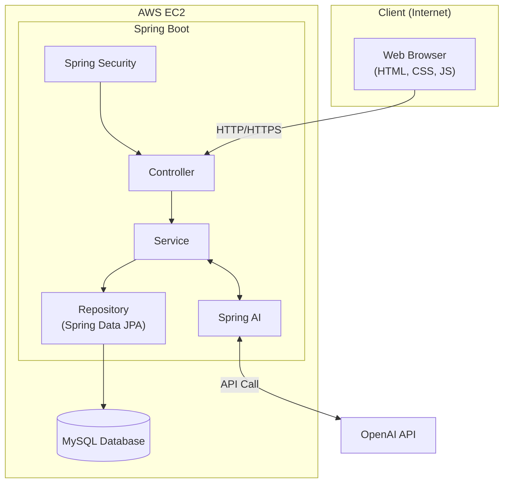

# 💼 첫출근 (First Job)

> **구직자와 기업을 연결하는 AI 기반 채용 플랫폼**
>
> 개인회원, 기업회원, 관리자 서비스를 분리하고,
> Spring AI를 활용한 채용 지원 기능을 제공합니다.

---
## 🖥 서비스 미리보기

> 🚧 GIF 및 스크린샷 추가 예정

---

## 📖 프로젝트 소개

- 구직자와 기업을 연결하는 AI 기반 채용 플랫폼
- 개인회원, 기업회원, 관리자 서비스를 분리한 채용 서비스
- 실제 채용 프로세스를 반영한 입사지원 및 채용 관리 기능 구현
- Spring AI 기반 자기소개서 피드백, 맞춤 기업 추천, 채용공고 작성 지원 기능 구현

---

## 📅 개발 기간

> 🚧 작성 예정
- **ex) 2026.07.01 ~ 2026.08.15**

---

## 🛠 Tech Stack

### 🎨 Frontend

  

### ⚙️ Backend

  

- Spring Boot
- Spring Security
- Spring AI

### 🗄️ Database

  

### ☁️ Infrastructure

  

### 🛠️ Tools & Collaboration

  

---

## 🏗 프로젝트 아키텍처

---

## ✨ 주요 기능

### 👤 개인회원

<strong>👤 개인회원 기능 펼치기</strong>

#### 📊 대시보드

- 프로필 완성도
- 최근 지원 현황
- 관심 기업
- AI 맞춤 기업 추천

#### 🙍 프로필

- 프로필 조회 및 수정
- 희망 직무 / 지역
- 경력 관리
- 기술스택 관리

#### 📄 이력서

- 등록 / 수정 / 삭제
- 대표 이력서 설정
- 공개 / 비공개 설정

#### ✍ 자기소개서

- 등록 / 수정 / 삭제
- AI 피드백 제공

#### 📨 입사지원

- 이력서 선택
- 자기소개서 선택
- 지원 현황 조회
- 지원 취소

#### ⭐ 관심 기업

- 관심 기업 등록 / 해제
- 관심 기업 채용공고 확인

#### 📝 후기

- 기업 리뷰 작성
- 면접 후기 작성

---

### 🏢 기업회원

<strong>🏢 기업회원 기능 펼치기</strong>

#### 📊 대시보드

- 등록한 공고 수
- 진행 중인 공고
- 신규 지원자
- 면접 대상자
- 채용 완료 인원

#### 🏢 기업 정보

- 기업 소개
- 기업 로고
- 복지 및 근무환경
- 승인 상태 확인

#### 📢 채용공고

- 등록 / 수정 / 삭제
- 미리보기
- 공고 마감

#### 🤖 AI 채용공고 작성

- 채용공고 제목 초안 생성
- 주요 업무 초안 생성
- 자격요건 초안 생성
- 우대사항 초안 생성
- 포지션 소개 초안 생성

#### 👥 지원자 관리

- 지원자 조회
- 서류 결과 관리
- 면접 일정 관리
- 최종 합격 처리

#### 📈 채용 통계

- 조회수
- 지원자 수
- 합격 현황

#### ⚙ 계정 관리

- 담당자 정보 수정
- 비밀번호 변경
- 연락처 변경
- 회원 탈퇴

---

### 🛠 관리자

<strong>🛠 관리자 기능 펼치기</strong>

#### 📊 대시보드

- 회원 통계
- 채용공고 통계
- 승인 대기 현황
- 방문자 통계

#### 👤 회원 관리

- 개인회원 관리
- 기업회원 관리

#### ✅ 승인 관리

- 기업 승인 / 반려
- 채용공고 승인 / 반려

#### 📚 콘텐츠 관리

- 취업 콘텐츠 관리
- 고객센터 관리

#### 📝 후기 관리

- 기업 리뷰 관리
- 면접 후기 관리

#### 🎨 배너 관리

- 배너 등록 / 수정
- 노출 설정
- 메인 슬라이드 관리

#### 🏷 사이트 버전 관리

- 버전 등록
- 변경 이력
- 활성 버전 관리

---

## 🤖 Spring AI

> AI는 사용자의 작성을 보조하는 역할로 활용했습니다.

- ✍ 자기소개서 피드백
- 🏢 맞춤 기업 추천
- 📢 채용공고 초안 생성

---

## 🗄 ERD

> 🚧 작성 예정

---

## 👨‍💻 담당 역할

| 이름 | 역할 |
|------|------|
| **양지웅** | 🚧 작성 예정 |
| **강현주** | 🚧 작성 예정 |
| **오수현** | 🚧 작성 예정 |
| **최수빈** | 🚧 작성 예정 |

---

## 🔥 트러블슈팅

> 🚧 작성 예정

---

## 💭 프로젝트 회고

> 🚧 작성 예정